# CT15 -- Implementation Diagrams

Code-block diagrams referenced from `BinarySearchTree.cpp`.

---

## 1. Constructor / Destructor: Post-Order Deletion
*`BinarySearchTree.cpp::destroy_()` -- children freed before parent to avoid losing pointers*

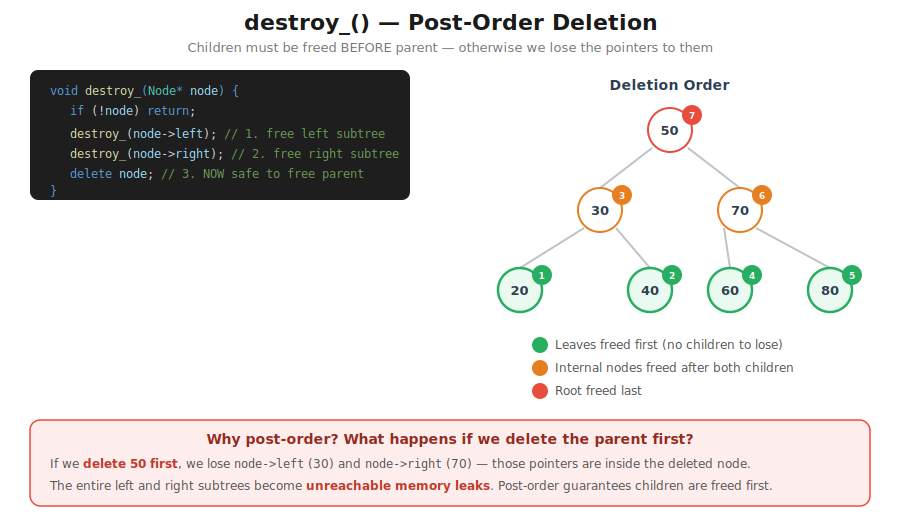

---

## 2. destroy_() Recursion Trace
*`BinarySearchTree.cpp::destroy_()` -- step-by-step trace showing every recursive call, base case, and deletion*

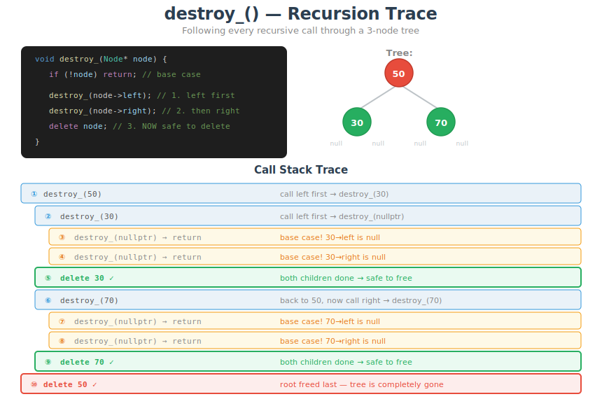

---

## 3. Insert Path
*`BinarySearchTree.cpp::insert_()` -- each comparison routes left or right; new node lands as a leaf*

---

## 4. insert_() Recursion Trace
*`BinarySearchTree.cpp::insert_()` -- step-by-step call stack inserting 40, showing the unwind that reattaches child pointers*

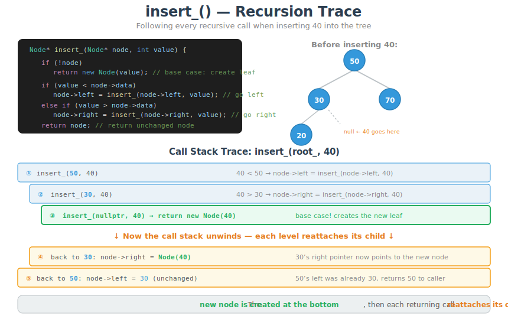

---

## 5. Search Path
*`BinarySearchTree.cpp::search_()` -- each comparison eliminates one subtree; O(log n) on balanced tree*

---

## 6. search_() Recursion Trace
*`BinarySearchTree.cpp::search_()` -- side-by-side traces: found (40) vs not found (45), showing how true/false bubbles up*

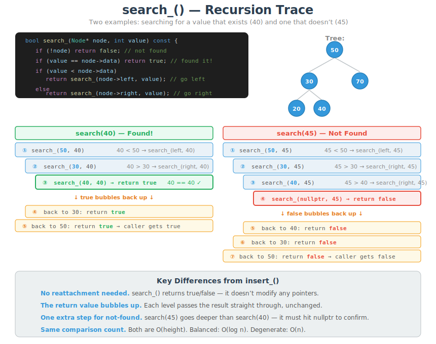

---

## 7. In-Order Traversal: Code + Trace
*`BinarySearchTree.cpp::inorder_()` -- Left, Print, Right on 5-node tree showing sorted output*

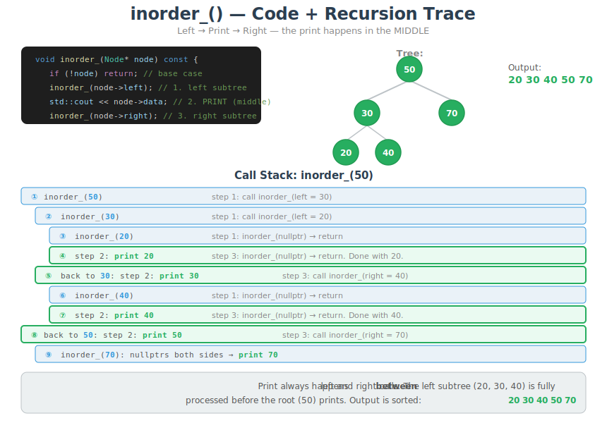

---

## 8. Pre-Order Traversal: Code + Trace
*`BinarySearchTree.cpp::preorder_()` -- Print, Left, Right on 5-node tree showing root-first output*

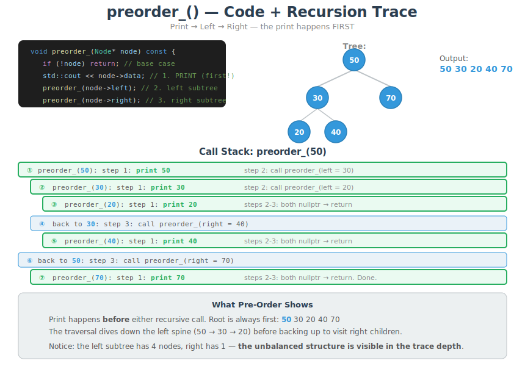

---

## 9. Post-Order Traversal: Code + Trace
*`BinarySearchTree.cpp::postorder_()` -- Left, Right, Print on 5-node tree showing leaves-first output*

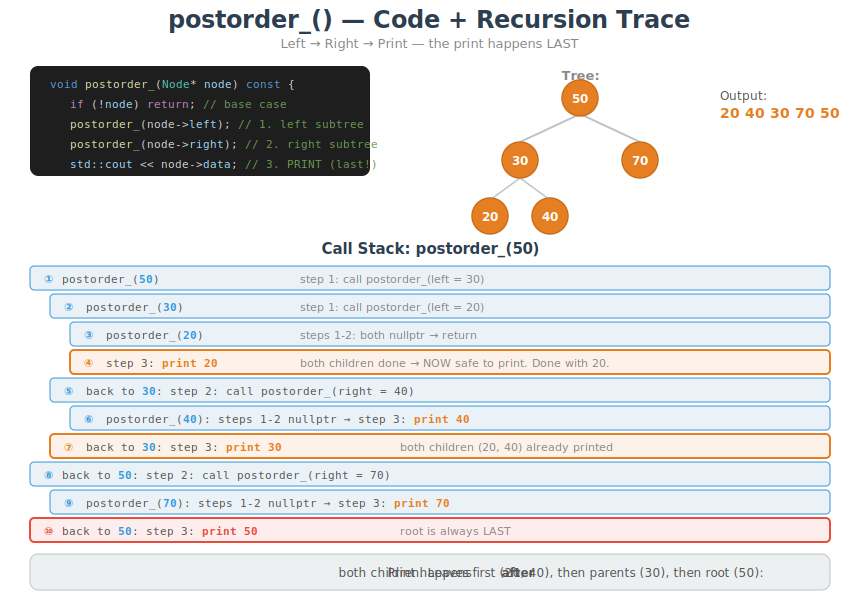

---

## 10. Height: Recursive Calculation
*`BinarySearchTree.cpp::height_()` -- base case nullptr=-1, each node adds 1+max(left, right)*

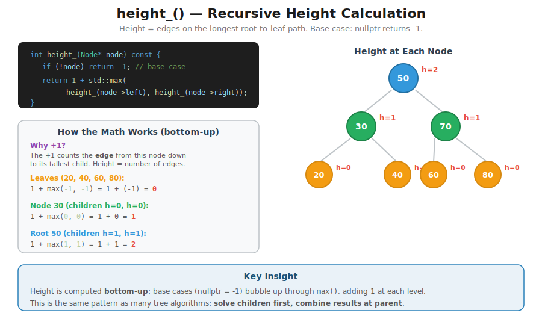

---

## 11. height_() Recursion Trace
*`BinarySearchTree.cpp::height_()` -- step-by-step bottom-up trace showing how -1 bubbles up through leaves to root*

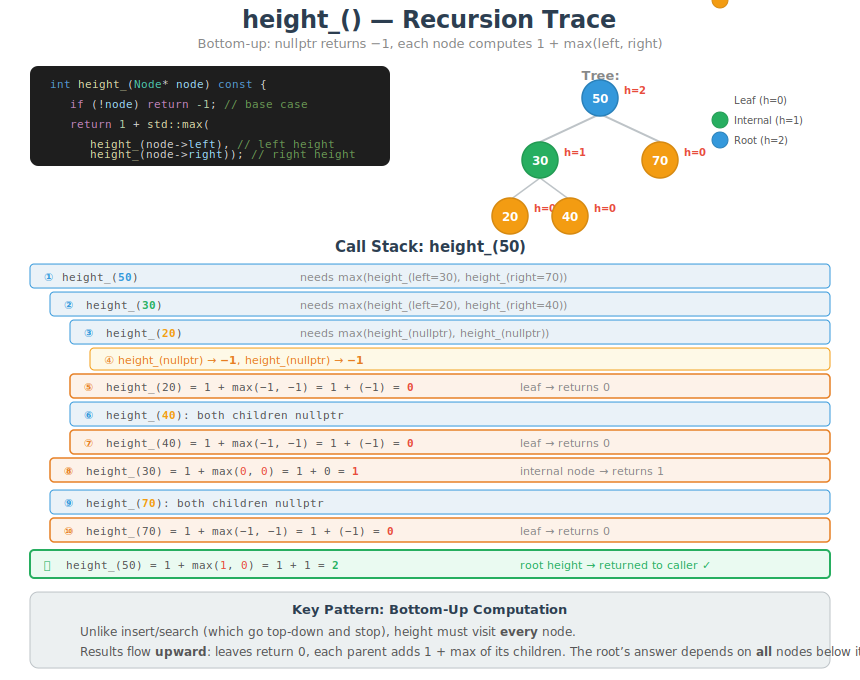

---

## 12. Functor-Based Traversal
*`BinarySearchTree.h::inorder_apply_()` -- same traversal logic, functor controls what happens at each node*

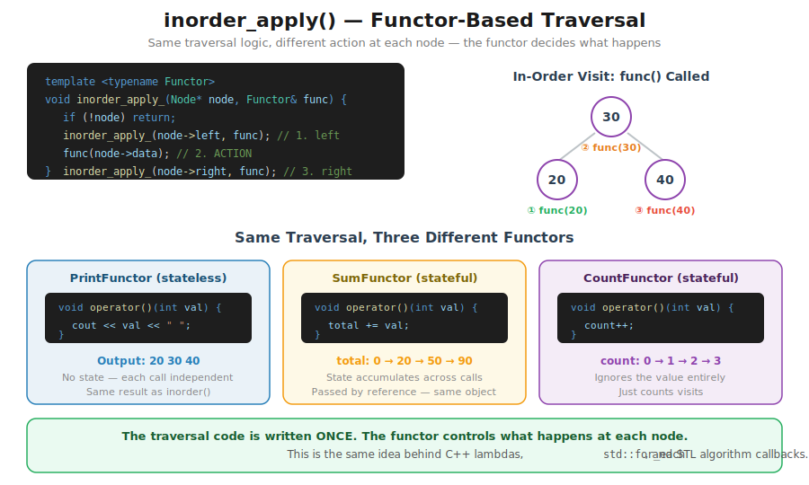

---

## 13. inorder_apply with PrintFunctor
*`BinarySearchTree.cpp` -- PrintFunctor running on the tree: stateless, prints each value in order*

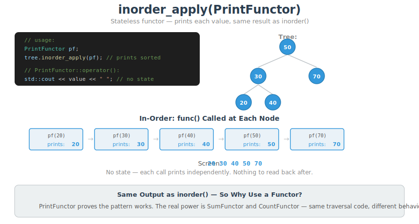

---

## 14. inorder_apply with SumFunctor
*`BinarySearchTree.cpp` -- SumFunctor running on the tree: stateful, total accumulates at each node*

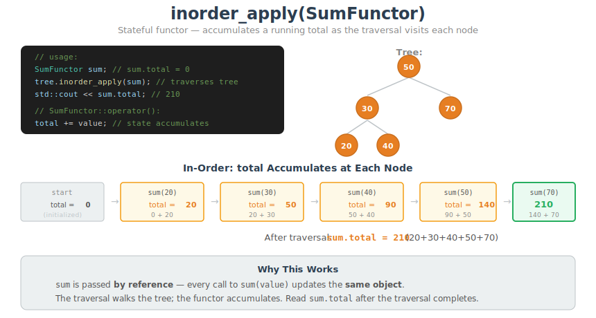

---

## 15. inorder_apply with CountFunctor
*`BinarySearchTree.cpp` -- CountFunctor running on the tree: stateful, counts nodes, ignores values*

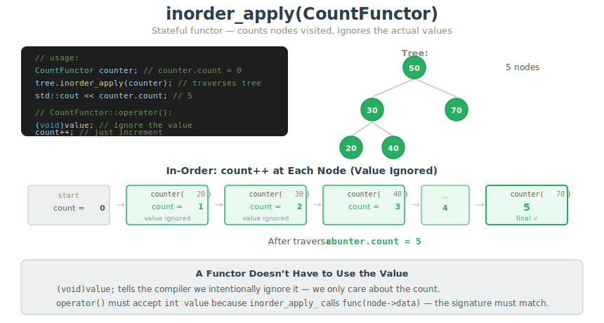
