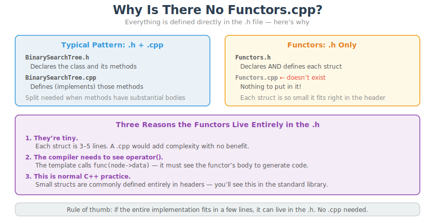
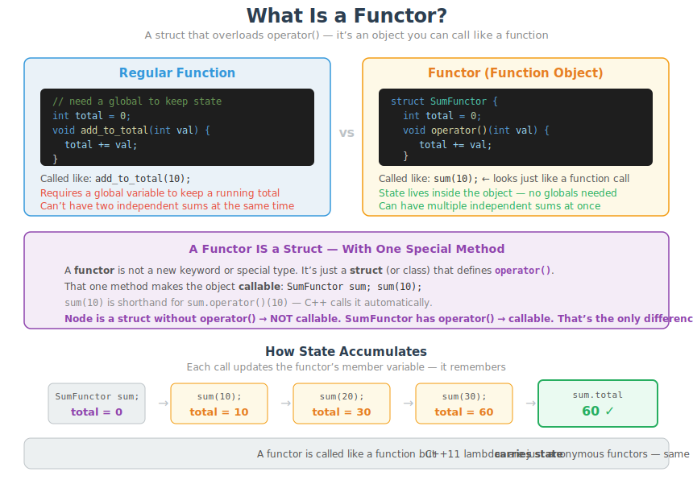
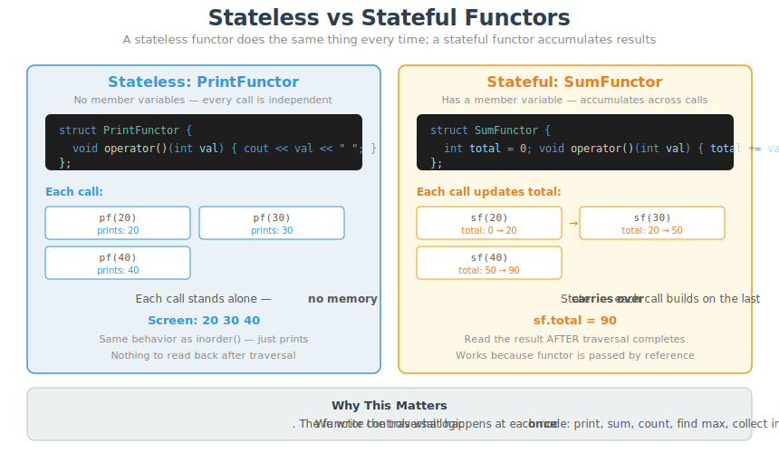
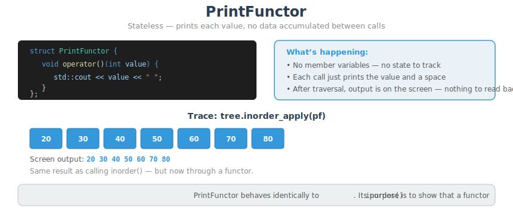
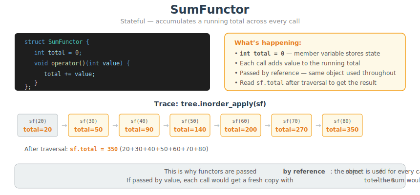
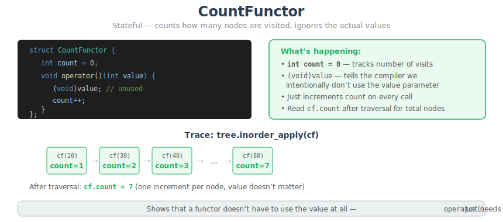

# CT15 -- Functor Diagrams

Conceptual diagrams referenced from `Functors.h`.

---

## 1. Why No Functors.cpp?
*`Functors.h` -- why these structs are defined entirely in the header with no .cpp file*

---

## 2. What Is a Functor?
*`Functors.h` -- a struct with operator() that can be called like a function but carries state*

---

## 3. Stateless vs Stateful Functors
*`Functors.h` -- PrintFunctor (no state, just prints) vs SumFunctor (accumulates a total across calls)*

---

## 4. PrintFunctor
*`Functors.h::PrintFunctor` -- stateless, prints each value, same behavior as inorder()*

---

## 5. SumFunctor
*`Functors.h::SumFunctor` -- stateful, accumulates a running total across every call*

---

## 6. CountFunctor
*`Functors.h::CountFunctor` -- stateful, counts nodes visited, ignores the actual values*

