# CT15 -- Header Diagrams

Conceptual diagrams referenced from `BinarySearchTree.h`.

---

## 1. Public/Private Helper Pattern
*`BinarySearchTree.h::class` -- why every recursive operation has a public wrapper and a private helper with Node**

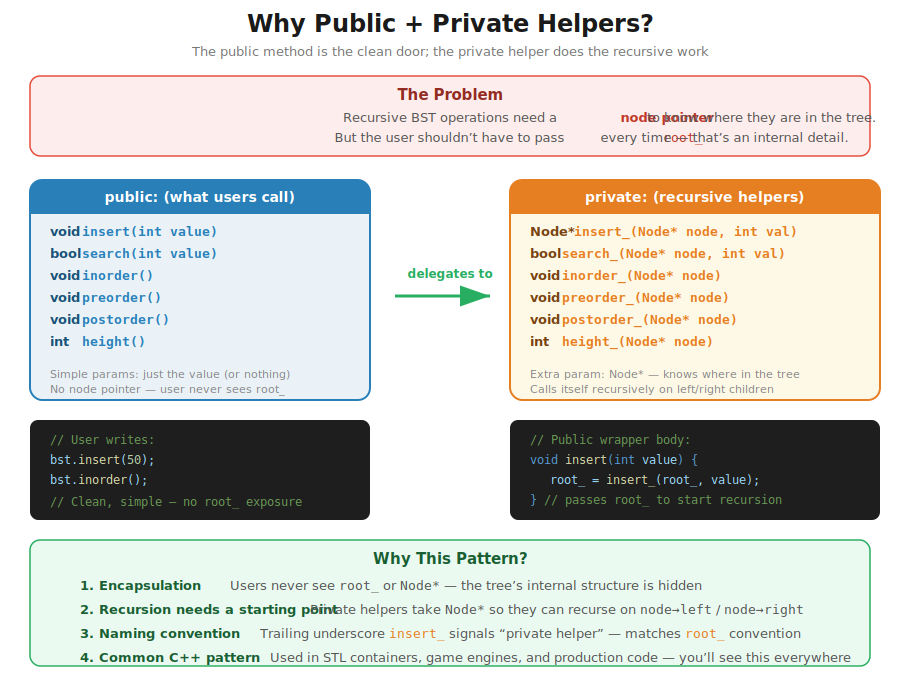

---

## 2. BST Property
*`BinarySearchTree.h` -- for every node N: all values in N->left < N->data < all values in N->right*

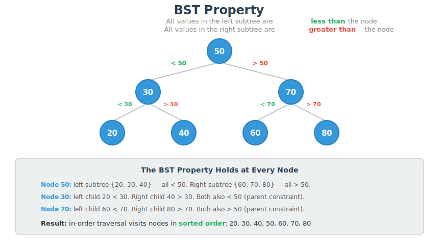

---

## 3. Node Structure
*`BinarySearchTree.h::Node` -- each node holds data, a left pointer (smaller), and a right pointer (larger)*

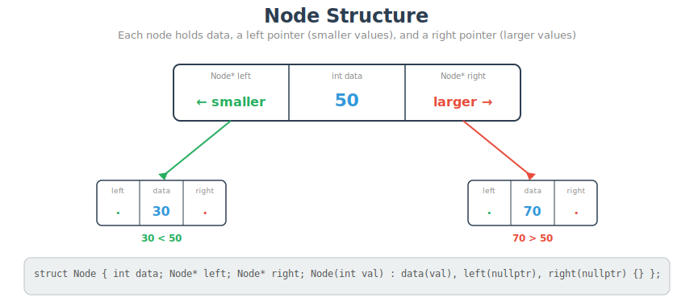

---

## 4. Insert
*`BinarySearchTree.h::insert()` -- each comparison routes left or right; the new node always lands as a leaf*

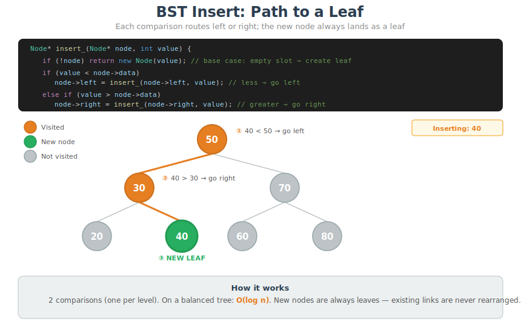

---

## 5. Search
*`BinarySearchTree.h::search()` -- each comparison eliminates one subtree; O(log n) on a balanced tree*

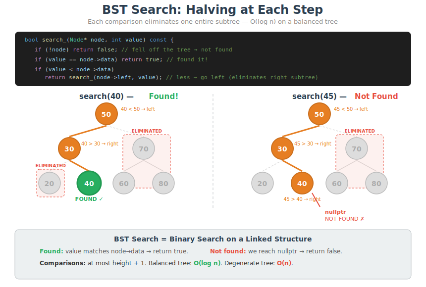

---

## 6. Height Convention
*`BinarySearchTree.h::height()` -- nullptr has height -1 so a leaf has height 0; balanced tree has height log2(n)*

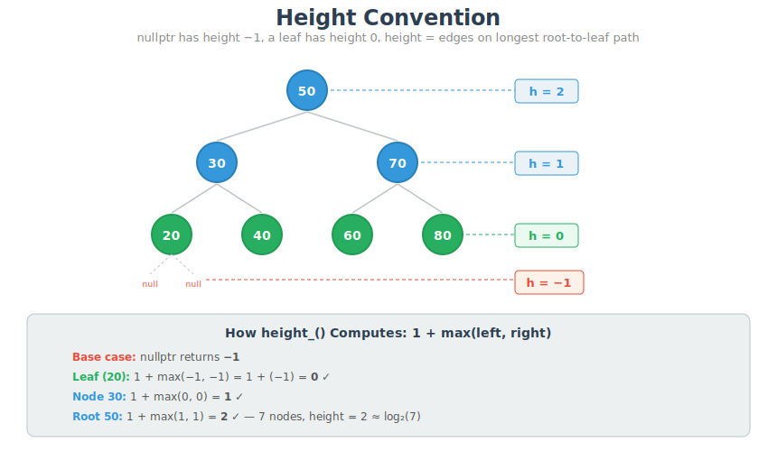

---

## 7. In-Order Traversal
*`BinarySearchTree.h::inorder()` -- Left, Root, Right -- produces sorted output on a BST*

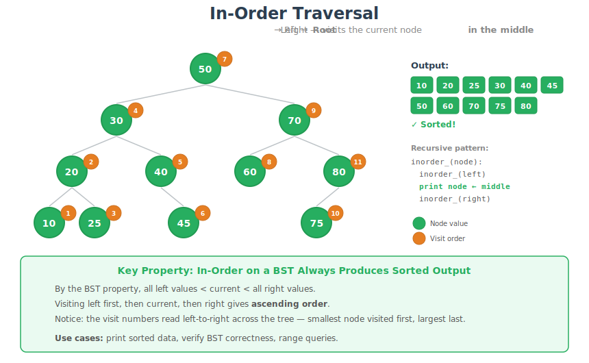

---

## 8. Pre-Order Traversal
*`BinarySearchTree.h::preorder()` -- Root, Left, Right -- captures tree structure for cloning*

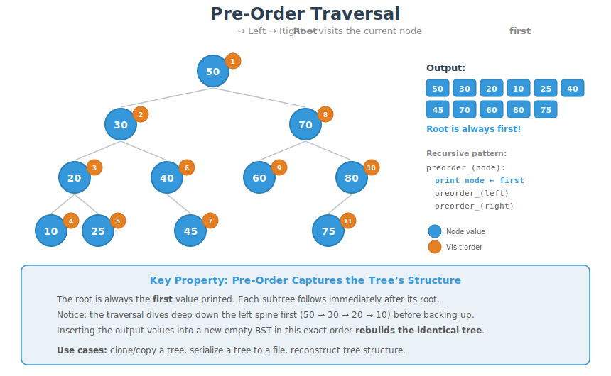

---

## 9. Post-Order Traversal
*`BinarySearchTree.h::postorder()` -- Left, Right, Root -- children before parent, used for safe deletion*

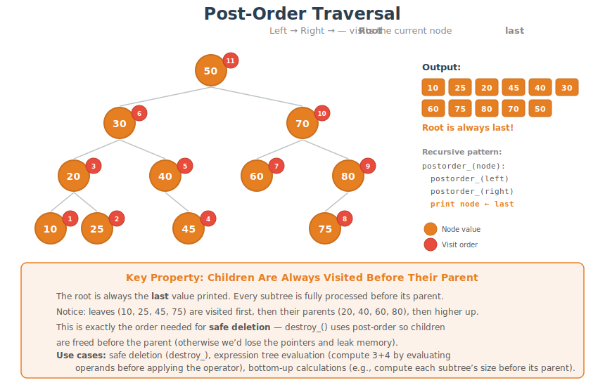

---

## 10. Why Functors? From inorder() to inorder_apply()
*`BinarySearchTree.h` -- inorder() can only print; a functor lets the same traversal sum, count, or do anything else*

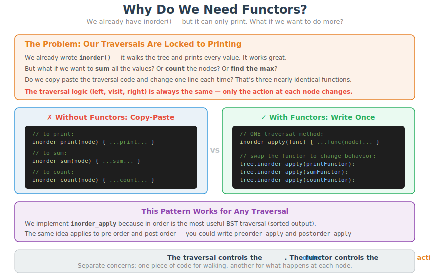

---

## 11. inorder_apply: Template + Functor
*`BinarySearchTree.h::inorder_apply()` -- what template&lt;typename Functor&gt; means, why it lives in the header, why passed by reference*

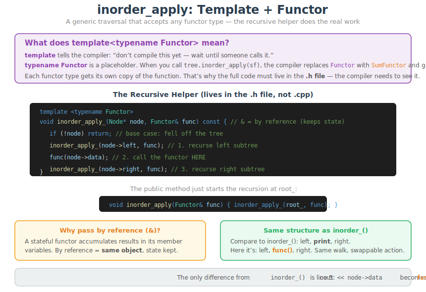

---

## 12. One Template, Three Functions
*`BinarySearchTree.h` + `Functors.h` -- the compiler generates a separate inorder_apply for PrintFunctor, SumFunctor, and CountFunctor*

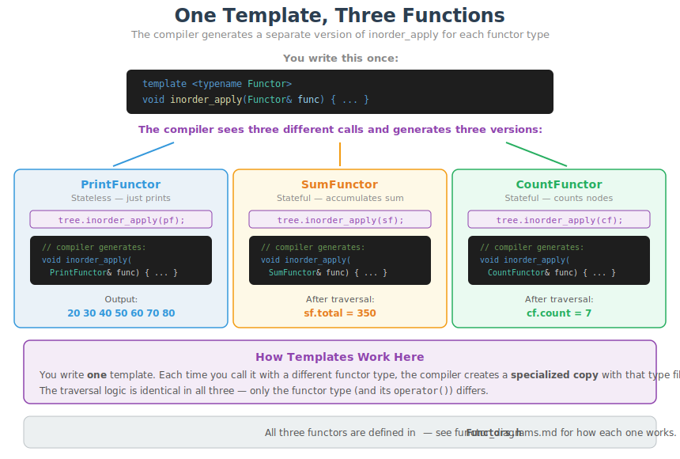
